# FireSim — mountain bushfire trainer

FireSim is a phone app for **beginner bush firefighters in the mountains of NSW** (Blue Mountains, Kanangra, Wollemi,
Budawangs, Snowy Mountains, Warrumbungles…). It builds a 3-D model of the country around you, takes the weather
(live, a past day, the forecast, a designed preset, a historic fire day or your own belt weather kit readings), lets
you mark where the fire is, and runs a **coupled 3-D atmosphere + fire spread + ember simulation** on the phone. Then it
explains **why** the fire does what it does: why it runs up that slope, why that gully is a chimney, why the flank
becomes the head when the southerly arrives, where embers land.

> ## ⚠ Training aid only
> FireSim is an **education tool**. It is **not an operational prediction** and must never be used to make decisions
> on a fireground. Always follow your Incident Controller, your Crew Leader and NSW RFS procedures. Fire models are
> simplified and can be badly wrong, especially on steep slopes, in gullies and in extreme weather, where real fires
> are often faster than any model. **LACES first**: Lookouts, Awareness, Communications, Escape routes, Safety refuges.
> Every number in the app is a *model estimate*; every insight card ends with doctrine, never with the model.

What FireSim **is**: a way to *predict, then observe* — make a call about where the fire will go, play it forward,
and read the plain-language explanation of the mechanism (with the literature behind it).
What it **is not**: a replacement for Phoenix / Spark / FBAN products, a forecast of a real fire, a map of real
incidents, or a guarantee that anywhere is safe.

| | | | |
|---|---|---|---|
| 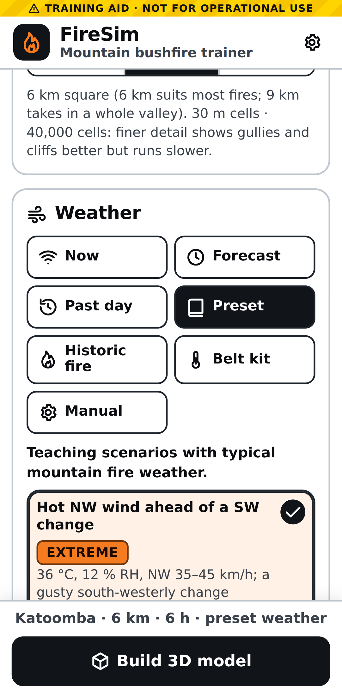 | 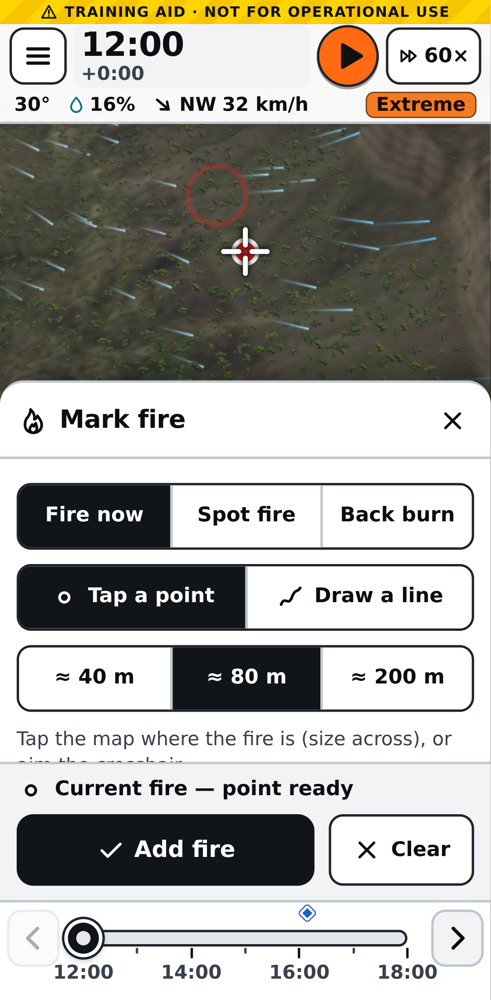 | 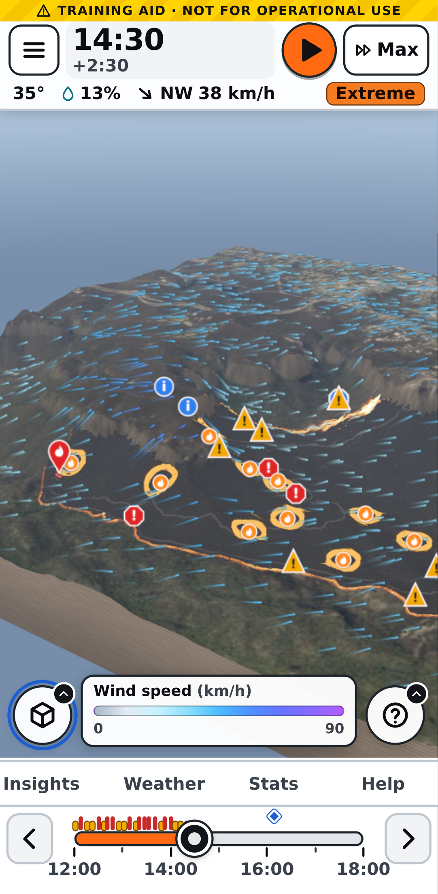 | 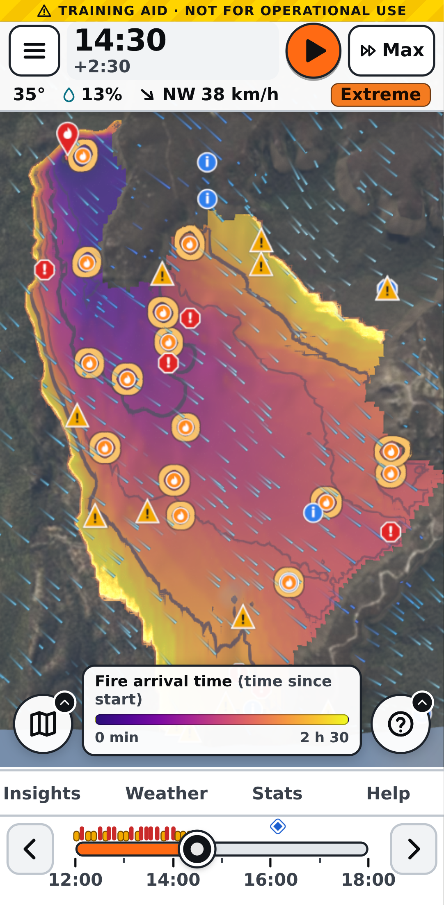 |
| Setup: demo site, preset weather | Mark the fire with the crosshair | 3-D view of the running fire | Top view, arrival-time overlay |
| 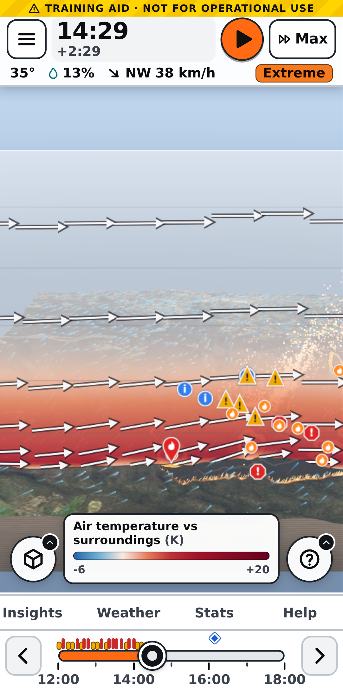 | 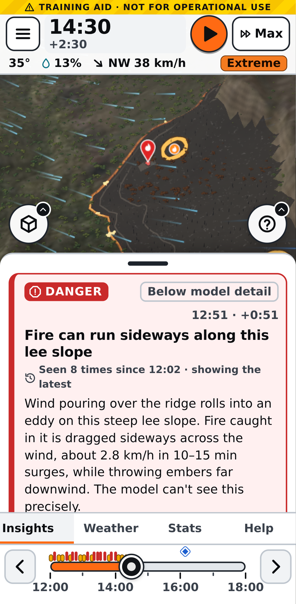 | 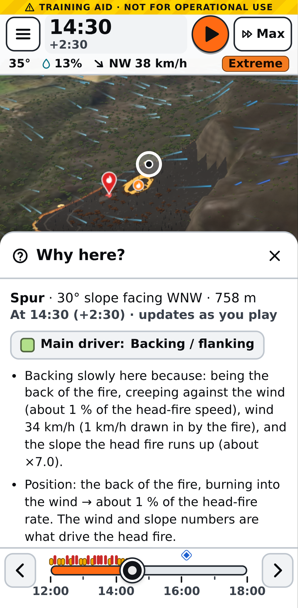 | 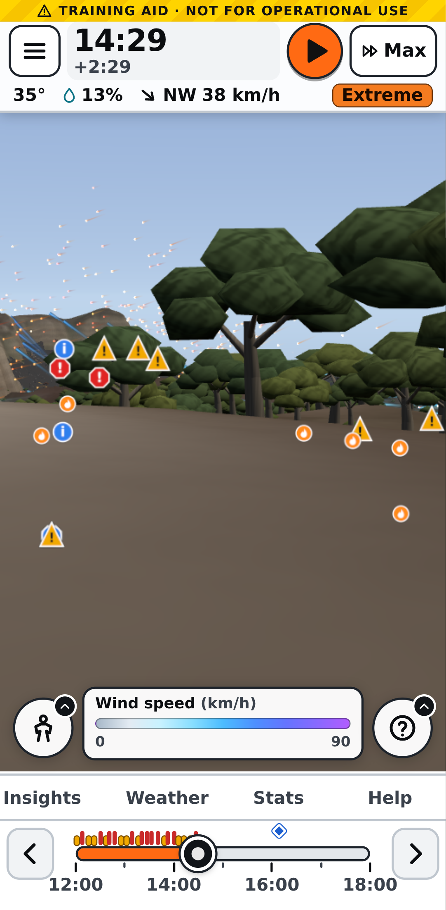 |
| Vertical cross-section (3-D atmosphere) | Insight cards | "Why here?" explanation | Eye level from a lookout |
| 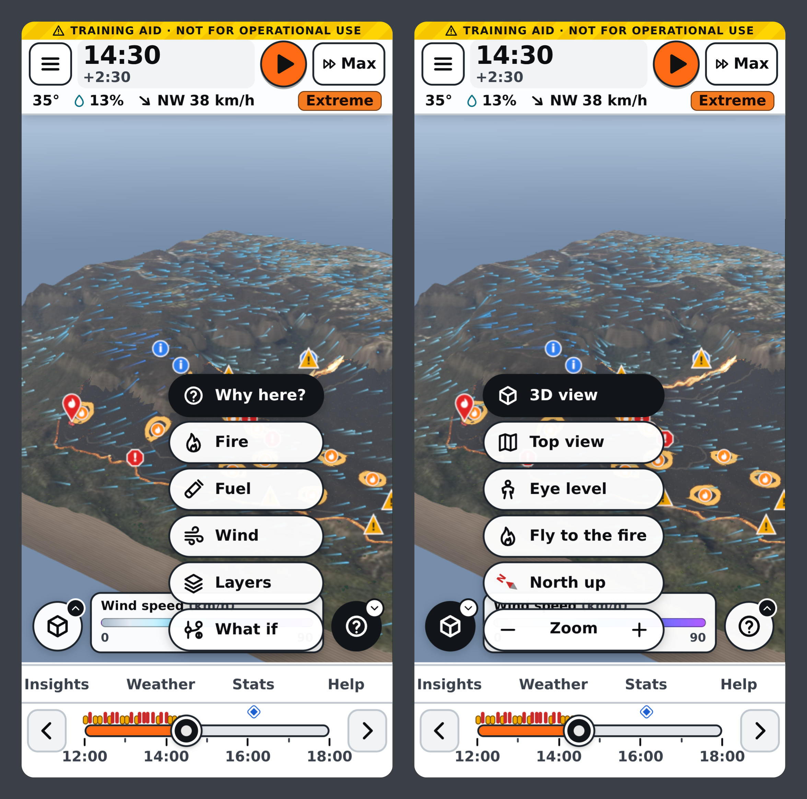 | 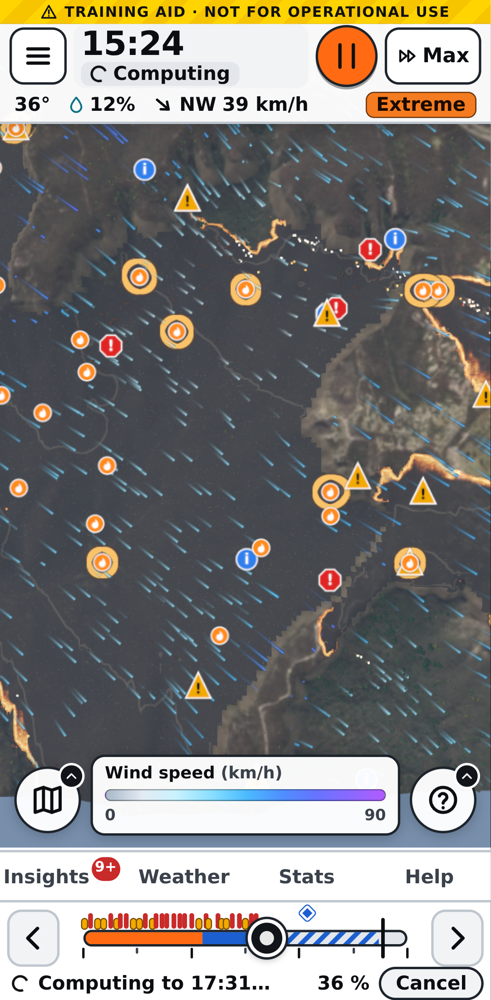 | 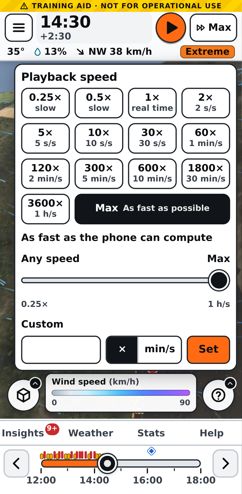 | |
| The two round menus, expanded (tools, view) | A jump far ahead computing, with Cancel | Playback speed options | |

The screenshots are produced by the end-to-end test (`e2e/app.spec.ts`) on a Pixel 7 profile with the real engine.

## Features

- **Where**: GPS, typed coordinates, or eight bundled **demo sites** with LiDAR terrain (10 m from the 5 m DTM),
  canopy height (from Meta's 1 m map), aerial imagery, vegetation and fire history — they work fully offline. 3–12 km square, 20 or 30 m fire grid.
- **Weather**: live (Open-Meteo best-match models incl. ECMWF IFS and GFS; BOM ACCESS-G is not used because its Open-Meteo feed returned no data), a past date (historical forecasts / ERA5), the forecast
  (up to 16 days), four designed **presets** (hot NW wind ahead of a SW change; calm night with katabatic drainage;
  mild spring hazard-reduction day; catastrophic Black-Summer-like day), seven **historic fire days** bundled offline
  (Blue Mountains Oct 2013, Grose / Gospers Mountain / Kanangra Dec 2019, Currowan 30 Dec 2019, Snowy Jan 2020,
  Wambelong Jan 2013), **belt weather kit** readings (psychrometer at station pressure, 2 m → 10 m wind), or manual
  entry with an optional wind change. Drought (KBDI, Drought Factor) from a year of daily rain.
- **Fuel**: NSW vegetation (SVTM) → fuel types, NPWS fire history → fuel accumulation, canopy height, with a
  plain-language **fuel brush** ("more leaf litter", "denser understorey", "stringybark", "less fuel (burnt / HR)",
  "road / track / rock", "wetter (gully / seepage)").
- **Fire**: mark the fire now (point or finger-drawn line), a spot fire ahead, or a back burn — also in the past,
  which re-runs the simulation from then. Wrong mark? Remove it and the run is repeated without it.
- **Simulation** (Web Worker, deterministic): dead fine fuel moisture per cell (aspect, shade, canopy, cold pools,
  dew, rain), Vesta Mk2 / CSIRO grassland / heath / pine models, a level-set front with directional slope, mountain
  phenomena (eruptive slopes and chimneys, vorticity-driven lateral spread, junction zones, rolling debris), a 3-D
  terrain-following atmosphere (slope winds, cold-air drainage, thermal belts, the fire's own indraft and plume) or a
  fast surface-wind tier on slower phones, and Lagrangian embers with spot-fire ignition.
- **Explanations**: insight cards as the fire does something worth learning (upslope run, ridge-crest slowdown,
  gully chimney, lee-slope eddy / VLS, spotting, crown fire, wind change: "the flank becomes the head", dead man zone,
  pyroconvection…), repeats grouped per phenomenon, "Show me" switches on the layer that makes it visible.
  **Why here?** — tap anywhere for the factor breakdown (wind, slope, moisture, fuel, terrain, position on the fire)
  and a narrative.
- **Views**: 3-D orbit, top view, eye level ("what you would see from here"), overlays (arrival time with isochrones,
  spread rate, intensity, spread driver, litter moisture, fuel load/type, time since fire, slope, aspect, sunlight,
  gullies, flame attachment, VLS, dead man zone, ember landings), wind particles (surface or through the plume),
  vertical cross-section, vertical exaggeration, compass and zoom buttons for gloved hands.
- **Time**: play at 0.25×–3600× (presets, a slider, or your own number), or as fast as the phone can; tap or drag the
  timeline, or type a time, to jump to ANY moment of the scenario: back is instant, and a time not yet computed becomes a
  fast-forward with its progress on the track (Cancel stops it, the view lands exactly on the time). Pictures are 60 s
  apart by default and can be 10 s to 10 min (Settings or the clock menu), with the solver step configurable too.
  **What if** (fire–atmosphere feedback, embers, mountain phenomena on/off → re-run from now and compare).
- **Field UX**: the map is the star: two collapsed round menus (tools, view) and a slim tab dock, nothing ever pops up
  over the simulation (new insight cards raise a badge on the Insights tab), big targets, crosshair placement for gloves
  and wet screens, high-contrast day and night themes, left/right-handed layout, opt-in vibration and pause on the first
  danger of each kind, screen-reader labels.

## The science

The model specification is [`docs/research/00-synthesis.md`](docs/research/00-synthesis.md) (normative; every
coefficient cites its evidence). It synthesises ten research reviews:

| | |
|---|---|
| [01 Terrain and fire behaviour](docs/research/01-terrain-fire-behaviour.md) | slope factor, eruptive fire, chimneys, ridges, junctions |
| [02 Mountain meteorology](docs/research/02-mountain-meteorology.md) | slope and valley winds, cold pools, thermal belts, lee eddies, wind changes |
| [03 Australian fire models](docs/research/03-australian-fire-models.md) | Vesta Mk2 / 2012, CSIRO grassland, heath, McArthur, AFDRS FBI |
| [04 Fuel moisture](docs/research/04-fuel-moisture.md) | dead fine fuel moisture, aspect and shade, KBDI and Drought Factor |
| [05 Fuel accumulation and fire history](docs/research/05-fuel-accumulation-history.md) | Olson curves, time since fire, SVTM → fuel |
| [06 Embers and spotting](docs/research/06-embers-spotting.md) | firebrand generation, lofting, transport, burnout, ignition probability |
| [07 Fire–atmosphere coupling](docs/research/07-fire-atmosphere-coupling.md) | the 3-D solver, fire heat release, convective number, plumes |
| [08 Data sources and APIs](docs/research/08-data-sources-apis.md), [08b live checks](docs/research/08b-live-endpoint-verification.md) | every endpoint the app uses |
| [09 Mobile tech stack](docs/research/09-mobile-tech-stack.md) | Capacitor, WebGL, workers, field UX |
| [10 Firefighter education](docs/research/10-firefighter-education.md) | LACES, Watch Outs, card wording, safety content |

Validation against the spec's scenarios (§15, V1–V22: slope ratios, wind–slope interaction, ridge crests, night
slowdown, katabatic and anabatic flows, spotting distances, VLS, gullies, wind changes, recent burns, junctions,
plume regimes, determinism and rewind) runs headless in `src/sim/validation/`.

## Data sources and licences

| Source | Used for | Licence |
|---|---|---|
| NSW Spatial Services | 5 m LiDAR elevation (DTM) and aerial imagery of the demo sites | © Spatial Services NSW, CC BY 4.0 |
| Meta & World Resources Institute | High Resolution Canopy Height Maps (Tolan et al. 2024) | CC BY 4.0 |
| SRTM via AWS Terrain Tiles (Mapzen Terrarium) | elevation outside the demo sites | public domain (NASA SRTM), AWS Open Data |
| Open-Meteo | forecasts, archive and historical forecasts (ECMWF IFS, GFS, ERA5) | CC BY 4.0; data © the national services |
| NSW National Parks and Wildlife Service | fire history (wildfires, prescribed burns) | © State of NSW and DCCEEW, CC BY 4.0 |
| NSW State Vegetation Type Map (SVTM) | vegetation formations and classes → fuel types | © State of NSW and DCCEEW, CC BY 4.0 |
| NSW Rural Fire Service | current incidents and fire danger ratings (when online) | © NSW RFS, for information only |

The same list is in the app (Settings → About). The bundled demo data are in `public/demo/<site>/` (each file's
`.json` names its source) and the historic weather in `public/replays/`.

## Run it

Requirements: Node 20+ (22 used here), npm.

```bash
npm install
npm run dev          # http://localhost:5173 — the dev server also proxies the canopy-height bucket (no CORS)
npm run build        # typecheck + production build into dist/ (relative URLs, module worker bundled)
npm run preview      # serve dist/ on http://localhost:4173
```

URL parameters (development, demos, tests): `?mock=1` runs the UI on the mock engine, 2-D map and mock builder (no
WebGL or worker needed); `?theme=light|dark`; `?notice=1` shows the safety notice again; `?debug=1` exposes
`window.__firesim` (session, view, scenario) in a production build.

### Tests

```bash
npm test                          # Vitest: every module, ~1300 tests incl. the §15 validation scenarios
FIRESIM_SKIP_SLOW=1 npm test      # skip the long 3-h Katoomba validation (src/sim/validation.test.ts)
SLOW=1 npx vitest run src/sim/validation   # include the long §15 scenarios (night, 6 h runs)
npx vitest run src/fire           # one module
npm run typecheck                 # tsc --noEmit
```

### End-to-end tests (Playwright)

```bash
npx playwright test               # builds, serves dist/ on :4173 and runs e2e/ on the Pixel 7 profile
PW_CHROMIUM=/path/to/chromium npx playwright test   # another Chromium (default /opt/pw-browsers/chromium)
```

Chromium runs with SwiftShader WebGL (no GPU needed). The server is reused if one is already running on :4173 — run
`npm run build` first so it serves the current code. The specs:

- `e2e/app.spec.ts` — the whole app with the **real modules**: safety notice → Katoomba demo (offline) → preset
  weather → build → mark a fire on the Megalong escarpment with the crosshair → play at maximum speed → the fire grows,
  grouped insight cards appear, "Why here?" explains, arrival overlay with its map legend, cross-section in the 3-D
  atmosphere, eye level, a jump back with the time menu, a fuel brush edit and a spot fire in the past, undoing the spot
  fire, then a jump far beyond the computed range that is cancelled part-way and an exact jump. Checks that nothing
  pops up over the simulation and playback never stops by itself. Writes the screenshots in `docs/screenshots/`.
- `e2e/sim.spec.ts` — the real engine in its Web Worker: timeline jumps (forward beyond the computed range, cancel,
  exact landing, a 10 s picture interval) and a whole scenario at maximum speed without a pop-up or a pause.
- `e2e/ui.spec.ts` — the UI on the mock engine (`?mock=1`): the collapsed menus and dock, the speed options, the
  timeline, the opt-in pause on Danger cards, settings and the belt weather kit.
- `e2e/android.spec.ts` — the app under an emulated Capacitor Android runtime.
- `e2e/helpers.ts` — shared helpers (menus, speed, timeline, the "no pop-up" watcher).

## Try it on an Android phone

The quickest way is the **debug APK** (about 27 MB, works offline with the eight demo sites):

1. Build it with `scripts/build-android-apk.sh` (installs the Android command-line SDK if needed, no Android Studio
   required), or use a copy someone has built for you. The file is `android/app/build/outputs/apk/debug/app-debug.apk`.
2. Copy it to the phone (download it, or `adb install -r app-debug.apk` over USB with developer mode on).
3. Open it on the phone. Android asks you to allow installing apps from that source (Chrome, Files, Drive…) — allow it
   for this install. Play Protect may warn that the app is from an unknown developer: it is signed with the Android
   *debug* key, so choose *Install anyway* (or *More details → Install anyway*).
4. Launch **FireSim**, accept the training notice, pick a demo site (e.g. Katoomba) and a preset weather, build, then
   mark a fire and press Play. "Use my location" asks for location permission the first time.

To update, install a newer APK over the old one. A debug APK is for testing only; see below for release builds.

## Build the phone apps (Capacitor 8)

The repository is Capacitor-ready (`capacitor.config.ts`, `@capacitor/android` and `@capacitor/ios` installed). The
Android project is committed in `android/` (location permissions and a FireSim launcher icon already added); the iOS
project is not (it needs Xcode on macOS). For Android, `scripts/build-android-apk.sh` builds a debug APK with just the
command-line SDK; for release builds and debugging use Android Studio (and Xcode on macOS for iOS) — see the Capacitor 8
documentation for the exact minimum versions.

```bash
npm run build:cap            # production build without source maps (vite build --mode capacitor)
npx cap sync                 # copy dist/ and the plugins into the native projects (after every build)
npx cap open android         # or: npm run cap:android  (build + sync + open in Android Studio)
npx cap add ios              # once, on macOS: creates ios/
npx cap open ios             # or: npm run cap:ios
```

For iOS, after `cap add ios`, add the location permission the "Use my location" button needs to
`ios/App/App/Info.plist`: `NSLocationWhenInUseUsageDescription` = "FireSim centres the 3-D model on where you are."
(The Android manifest already has `ACCESS_COARSE_LOCATION` and `ACCESS_FINE_LOCATION`.)

Notes: the app is served from `https://localhost` (Android) / `capacitor://localhost` (iOS); `CapacitorHttp` routes
`fetch` through the native stack, so no service depends on CORS on device (in the browser the NSW, RFS and
Open-Meteo services are called directly and only the canopy bucket is proxied). The simulation runs in an ES-module Web Worker (Android System WebView 80+, iOS 15+). The bundle
is ~32 MB, of which ~29 MB are the demo sites; remove sites from `public/demo/` (and `src/data/demoSites.ts`) for a
smaller app.

## Offline use and area packs

Mountain firegrounds often have no signal. FireSim works fully offline for the demo sites (terrain, canopy,
imagery, vegetation, fire history), the presets, the historic replays, the belt weather kit and manual weather.
Elsewhere, **save an area pack** before you go: Setup → Run → *Save this area for offline use* (with the network
on) downloads the 10 m terrain, canopy, SVTM vegetation, NPWS fire history, the latest forecast and a year of daily
rain for the chosen square into the device's IndexedDB (`src/scenario/areaPack.ts`, `src/data/cache.ts`). With
*Use the network* off, the builder uses bundled data, then area packs, then the cache, then inference and
synthetic fallbacks — each fallback is listed as a warning on the build screen and in Stats → Data used.

## Performance

Measured in headless Chromium on one 2.1 GHz Xeon core (x86), Katoomba 6 km at 30 m (200 × 200 fire cells), the
extreme "hot NW wind" preset with the fire on the escarpment, 4 simulated hours (a ~2 000 ha fire):

| | fast tier (surface wind) | standard tier (3-D atmosphere 45 × 45 × 20) |
|---|---|---|
| worker throughput | **≈ 900 simulated s per wall s** (4 h in 16 s) | **≈ 220 s/s** (4 h in 66 s) |
| scenario → first snapshot | 1.2 s (moisture spin-up) | 1.1 s, then 3-D spin-up ≈ 3 s |
| first result after Play | 0.3 s | 0.3 s once spun up (the spin-up runs while you mark the fire) |
| snapshot size (transferred) | 1.8 MB | 2.6 MB |

Inside the app (with the 3-D view rendering in software GL on the same CPU) the fast tier runs at 600–900 s/s. On
the main thread no task over 50 ms was observed while playing at maximum speed; updating the 3-D view from a
snapshot takes 4 ms median, 9 ms p95. Phones are about 2–3× slower than this core, so the fast tier gives a 6-hour
run in about a minute and the standard tier keeps up with the default 60× playback.

Tiers: *Settings → Performance*: **Auto** (default) times the first 20 steps of the 3-D spin-up and picks the standard
tier only if a 6-hour run would take ≤ 2 minutes, else the fast tier (spec §12.6); **Battery saver** = fast;
**Best quality** = high (3-D, 24 levels). A fast-tier run can be switched to the 3-D atmosphere from the Layers panel
(cross-section / "through the plume") — the worker restores the last checkpoint and re-runs. The 3-D view adapts its
resolution to the frame rate and draws only when something changes; snapshots stream every 5 simulated minutes into a
memory-capped replay store (≈ 6 % of the device memory, 48–160 MB).

## Architecture

TypeScript + Vite web app in a Capacitor shell; Three.js (WebGL2) for the 3-D view; all numerical code is plain
TypeScript on typed arrays, running in a Web Worker and unit-tested in Node. Details, contracts and the coupling
loop: [`docs/ARCHITECTURE.md`](docs/ARCHITECTURE.md).

```
 Setup ─► scenario/buildScenario ─► data/ (bundled · area pack · cache · network) ─► terrain/ + fuel/ ─► ScenarioData
                                                                                                          │ init
  UI (ui/session) ◄── snapshots, insights, explanations ── SimClient ◄──postMessage──► sim/worker ◄───────┘
   │  └► render/SceneView (terrain, trees, flames, smoke, embers, wind, overlays, cross-section)
   └─ ignitions · fuel/wind edits · what-if · rewind ──► sim/Simulation: moisture → atmosphere → fire → embers → explain
```

| Module | What it does |
|---|---|
| `src/core` | shared types and contracts (`types.ts`, `simTypes.ts`), grids, local projection, units, seeded RNG, shared physics |
| `src/data` | bundled assets, HTTP (native / dev proxy), IndexedDB cache and area packs, terrain tiles, canopy, demo rasters and sites |
| `src/terrain` | slope, aspect, curvature, TPI, landforms, solar position, insolation with terrain shadows, hillshade |
| `src/fuel` | fuel catalogue, SVTM mapping, vegetation inference, fire history and accumulation, fuel map and edits |
| `src/fuel/moisture` | dead fine fuel moisture per cell, stable nights and cold pools, KBDI / Drought Factor, availability, ignition probability |
| `src/fire/models` | Vesta Mk2 / 2012, CSIRO grassland, heath, pine, McArthur, intensity, flame height, spotting, AFDRS FBI |
| `src/fire/terrainFeatures.ts` | gullies / chimneys, ridges, saddles, lee slopes for the mountain phenomena |
| `src/fire/spread` | level-set spread with directional slope, mountain phenomena, spread-driver attribution, checkpoints |
| `src/atmosphere` | mass-consistent background wind, 3-D terrain-following Boussinesq solver, slope flows, fire heat, fast `DiagnosticWind` |
| `src/embers` | Lagrangian firebrands: emission, lofting, transport, burnout, landing and spot-fire ignition |
| `src/explain` | insight detectors and card texts, forecast cards, "Why here?" cell explanation |
| `src/scenario` | the build pipeline, weather sources (Open-Meteo), presets, replays, belt kit, area packs, live feeds |
| `src/sim` | `Simulation` (coupling loop, records, checkpoints, rewind, tiers), `SimHost`, worker, `SimClient` |
| `src/render` | `SceneView`: terrain, vegetation, flames, embers, smoke, wind particles, overlays, cross-section, camera rig |
| `src/ui` | app shell, setup / building / simulation screens, session (time, playback, edits), panels, mocks |

## Known limitations

- The models are simplified and calibrated for education; many mountain-effect coefficients are hypotheses flagged
  [H]/UNVERIFIED in the spec (§16). Real fires on steep slopes and in extreme weather are often faster.
- On most phones the auto-tune picks the fast surface-wind tier; the plume, cold-air pools and the cross-section need
  the 3-D atmosphere (one tap in Layers, or *Best quality*), which is 3–4× slower.
- Validation (`src/sim/validation/`): the spec's §15 scenarios pass, including gully-vs-sunny-slope litter moisture
  (V8), lateral spread rate on lee slopes (V10), the fire-induced-wind card (V15) and coupled head ROS in both tiers
  (V22). Remaining gaps: the V20 speed gates are missed for very large (≈ 3 000–5 000 ha) fires, the standard tier
  reproduces the forecast 10 m wind on flat ground to ≈ 1 % on average but up to ≈ 4 % in single cells (V21), and one
  long forecast-fixture scenario is still an expected failure.
- Weather and live data need the network (or an area pack). On device, requests go through CapacitorHttp; in the
  browser (including an installed PWA) the NSW, RFS and Open-Meteo services are called directly — all send CORS headers
  (verified live, doc 08b). Only the remote canopy-height bucket needs the dev-server proxy (or a deployment proxy).
- Snapshots are dense (≈ 2 MB each); long runs are thinned in the replay store to fit its memory budget.

## Licence

Code: MIT (see `package.json`). Bundled data keep their own licences (table above; CC BY 4.0 requires attribution,
which the app shows in Settings → About).
