# FireSim — mountain bushfire trainer

FireSim is a phone app for **beginner bush firefighters in the mountains of NSW** (Blue Mountains, Kanangra, Wollemi,
Budawangs, Snowy Mountains, Warrumbungles…). It builds a 3-D model of the country around you, takes the weather
(live, a past day, the forecast, a designed preset, a historic fire day or your own belt weather kit readings), lets
you mark where the fire is, and runs a **coupled 3-D atmosphere + fire spread + ember simulation** on the phone. Then it
explains **why** the fire does what it does: why it runs up that slope, why that gully is a chimney, why the flank
becomes the head when the southerly arrives, where embers land.

> ## ⚠ Training aid only
> FireSim is an **education tool**. It is **not an operational prediction** and must never be used to make decisions
> on a fireground. Always follow your Incident Controller, your Crew Leader and NSW RFS procedures. Fire models are
> simplified and can be badly wrong, especially on steep slopes, in gullies and in extreme weather, where real fires
> are often faster than any model. **LACES first**: Lookouts, Awareness, Communications, Escape routes, Safety refuges.
> Every number in the app is a *model estimate*; every insight card ends with doctrine, never with the model.

What FireSim **is**: a way to *predict, then observe* — make a call about where the fire will go, play it forward,
and read the plain-language explanation of the mechanism (with the literature behind it).
What it **is not**: a replacement for Phoenix / Spark / FBAN products, a forecast of a real fire, a map of real
incidents, or a guarantee that anywhere is safe.

| | | | |
|---|---|---|---|
|  |  |  |  |
| Setup: demo site, preset weather | Mark the fire with the crosshair | 3-D view of the running fire | Top view, arrival-time overlay |
|  |  |  |  |
| Vertical cross-section (3-D atmosphere) | Insight cards | "Why here?" explanation | Eye level from a lookout |
|  |  |  | |
| The two round menus, expanded (tools, view) | A jump far ahead computing, with Cancel | Playback speed options | |

The screenshots above are produced by the end-to-end test `e2e/app.spec.ts` (Pixel 7 profile, the real engine). The new screens
below come from `e2e/gallery.spec.ts` (the same build, in light, night and high-contrast looks) and are 412 x 839 CSS pixels.

| | | | |
|---|---|---|---|
| 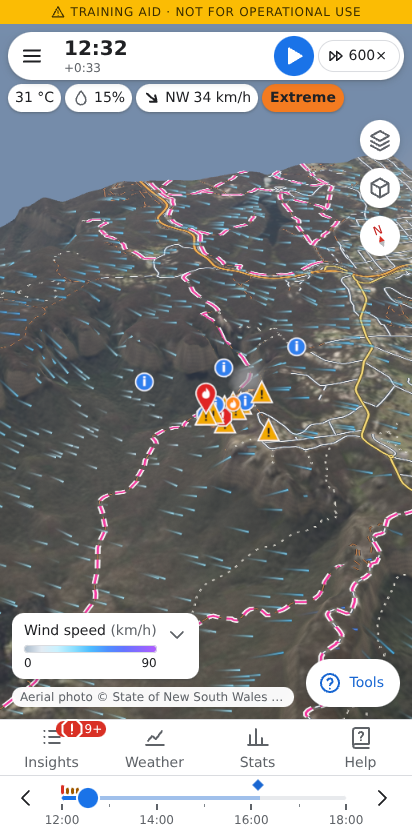 | 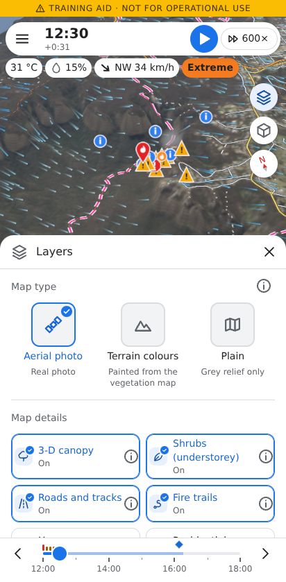 | 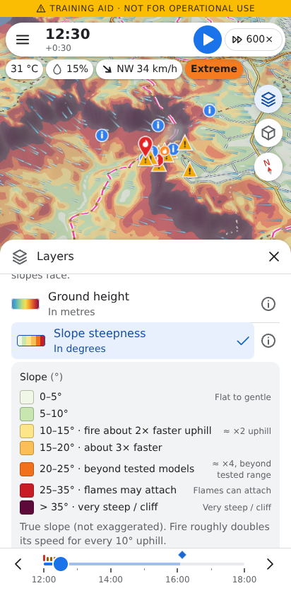 | 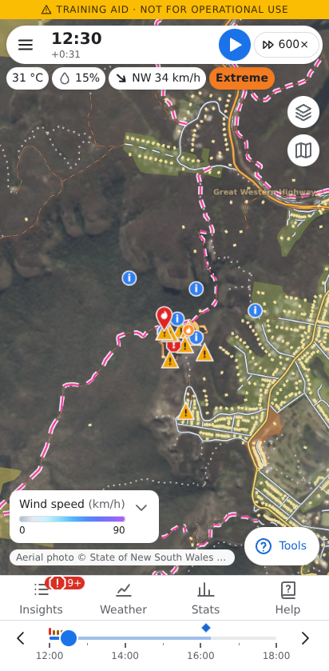 |
| The run in the flat look: floating top pill, round map buttons, Tools, bottom navigation | Layers: map type, then a switch for every kind of map detail | One data layer as a heat map, on its own, with its legend | Roads, fire trails, homes, residential zones and place names to find yourself |
| 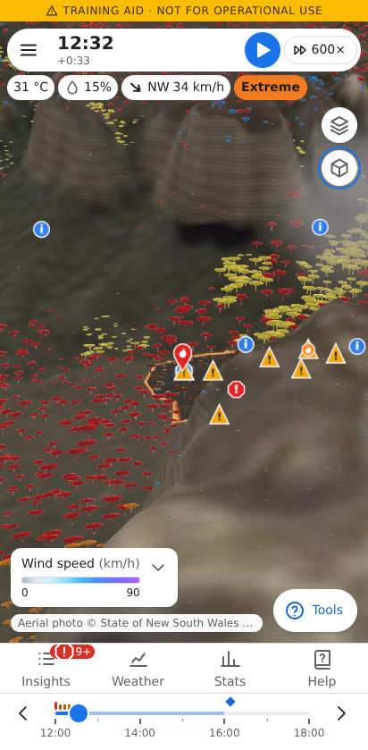 | 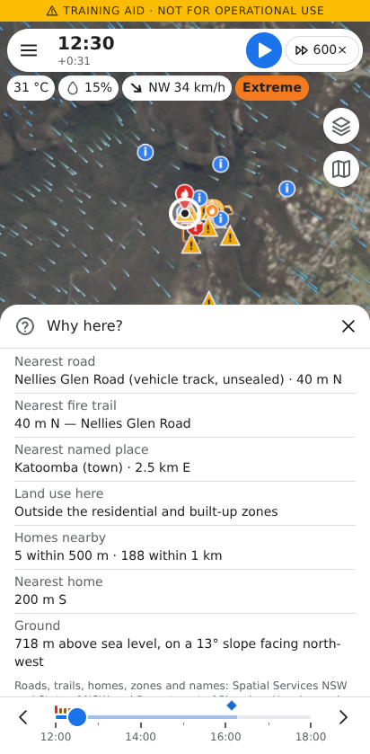 | 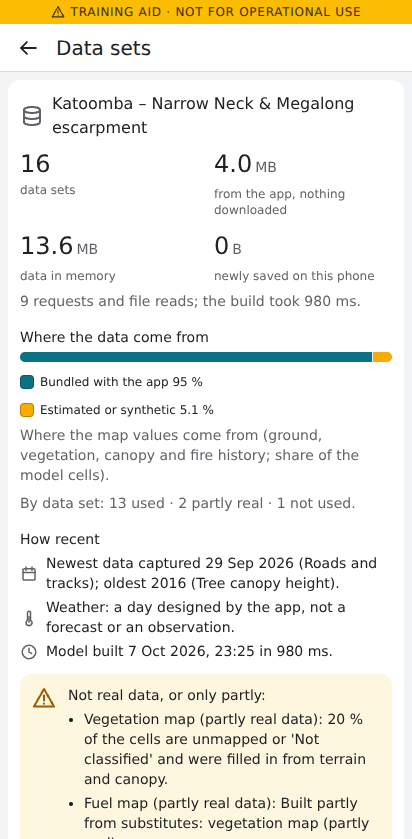 | 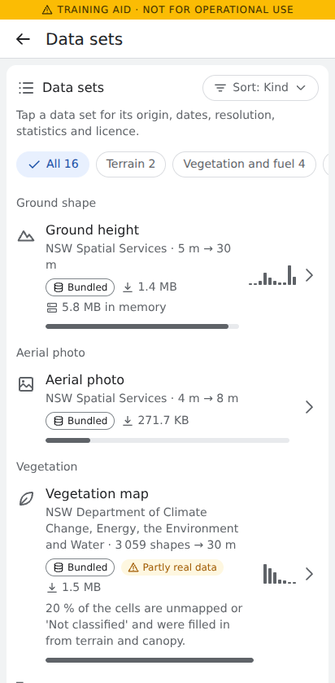 |
| Trees colour-coded by bark (ember) hazard | "Why here?" also says where you are: nearest road and trail, homes, the ground | Data sets: size, origin and age of everything the model was built from | One row per data set, with its origin and size |
| 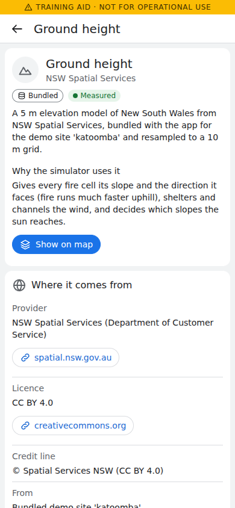 | 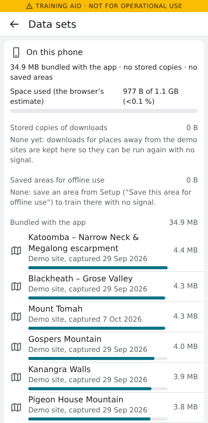 | 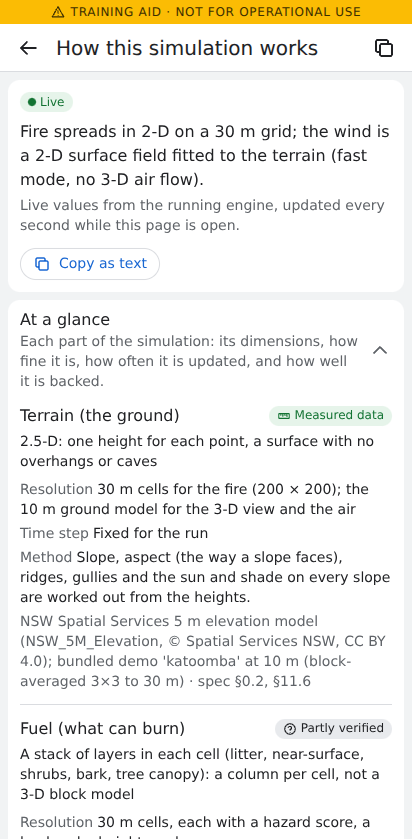 | 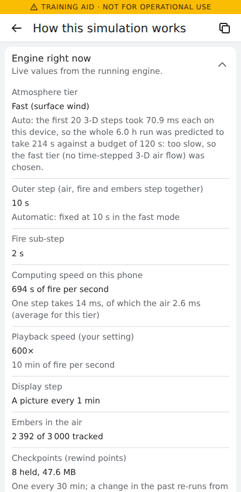 |
| One data set: source, licence, resolution, trust | What the app keeps on the phone; deletions always ask first | How this simulation works: what is 2-D, what is 3-D | The engine's own grid sizes and steps, live |
| 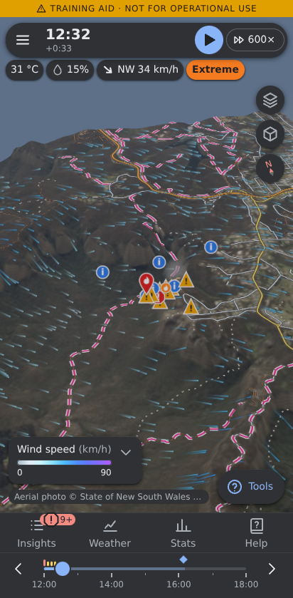 | 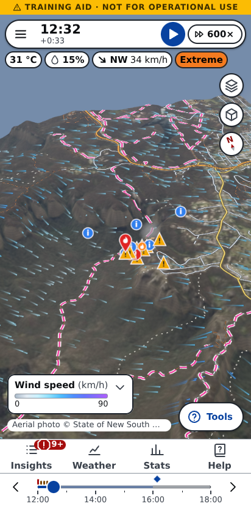 | 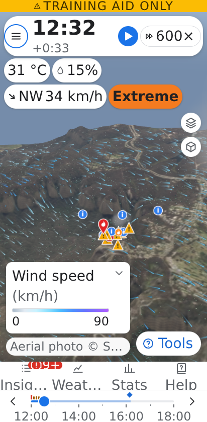 | 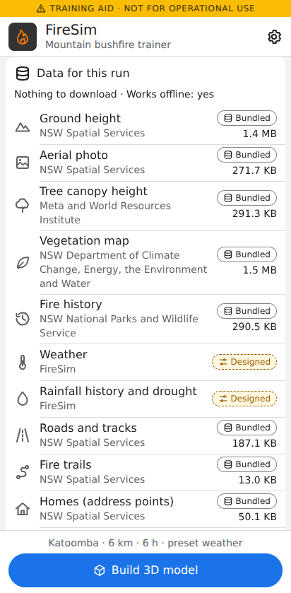 |
| The night look | High contrast ("bright sun") | Android's 200 % font scale | Setup plans the data before anything is downloaded |

Every new picture also exists in `-dark` and `-high-contrast` versions in `docs/screenshots/`; the design system and the screens on
their own are in `docs/screenshots/design/` (`scripts/app-screenshots.mjs`).

## Features

- **Where**: GPS, typed coordinates, or eight bundled **demo sites** with the NSW 5 m elevation model (bundled at 10 m),
  canopy height (from Meta's 1 m map), aerial imagery, vegetation and fire history — they work fully offline. 3–12 km square, 20 or 30 m fire grid.
- **Weather**: live (Open-Meteo's automatic 'best match' forecast for the location, ECMWF IFS as the fallback, upper-air levels from ECMWF IFS 0.25° or GFS; BOM ACCESS-G is not requested: Open-Meteo reports its open data as suspended), a past date (historical forecasts / ERA5), the forecast
  (up to 16 days), four designed **presets** (hot NW wind ahead of a SW change; calm night with katabatic drainage;
  mild spring hazard-reduction day; catastrophic Black-Summer-like day), seven **historic fire days** bundled offline
  (Blue Mountains Oct 2013, Grose / Gospers Mountain / Kanangra Dec 2019, Currowan 30 Dec 2019, Snowy Jan 2020,
  Wambelong Jan 2013), **belt weather kit** readings (psychrometer at station pressure, 2 m → 10 m wind), or manual
  entry with an optional wind change. Drought (KBDI, Drought Factor) from a year of daily rain.
- **Fuel**: NSW vegetation (SVTM) → fuel types, NPWS fire history → fuel accumulation, canopy height, with a
  plain-language **fuel brush** ("more leaf litter", "denser understorey", "stringybark", "less fuel (burnt / HR)",
  "road / track / rock", "wetter (gully / seepage)").
- **Fire**: mark the fire now (point or finger-drawn line), a spot fire ahead, or a back burn — also in the past,
  which re-runs the simulation from then. Wrong mark? Remove it and the run is repeated without it.
- **Simulation** (Web Worker, deterministic): dead fine fuel moisture per cell (aspect, shade, canopy, cold pools,
  dew, rain), Vesta Mk2 / CSIRO grassland / heath / pine models, a level-set front with directional slope, mountain
  phenomena (eruptive slopes and chimneys, vorticity-driven lateral spread, junction zones, rolling debris), a 3-D
  terrain-following atmosphere (slope winds, cold-air drainage, thermal belts, the fire's own indraft and plume) or a
  fast surface-wind tier on slower phones, and Lagrangian embers with spot-fire ignition.
- **Explanations**: insight cards as the fire does something worth learning (upslope run, ridge-crest slowdown,
  gully chimney, lee-slope eddy / VLS, spotting, crown fire, wind change: "the flank becomes the head", dead man zone,
  pyroconvection…), repeats grouped per phenomenon, "Show me" switches on the layer that makes it visible.
  **Why here?** — tap anywhere for the factor breakdown (wind, slope, moisture, fuel, terrain, position on the fire)
  and a narrative.
- **Views**: 3-D orbit, top view, eye level ("what you would see from here"), wind particles (surface or through the plume),
  vertical cross-section, vertical exaggeration, compass and zoom buttons for gloved hands. One finger slides the map, two fingers
  turn, tilt and zoom it, all at once (see *Controls*).
- **Layers**: one panel built from a catalogue of layers (`src/render/layerCatalog.ts`), each with a plain "what it shows, why it
  matters, where the data come from, how fine it is". *Map type* (aerial photo, terrain colours, plain); *Map details*, a switch for
  each: 3-D canopy, shrubs, **roads and tracks**, **fire trails**, **homes**, **residential and built-up areas**, **place names**,
  flames, smoke, embers, wind streaks, insight markers; and *Heat maps*, every data layer as a colour map of the ground (cool = little,
  warm = much), one at a time, optionally **on its own** (the photo and the trees step aside): ground height, landform, slope, aspect,
  sunlight, tree height and cover, shrub height, the four fuel hazards (leaf litter, grass and low shrubs, shrubs, bark), grass curing,
  fuel type and load, years since fire, wildfire or prescribed burn, homes per hectare, distance to a road, wind speed, litter moisture
  and the fire results (arrival time with isochrones, spread rate, intensity, spread driver, flame attachment, VLS, dead man zone, ember
  landings). A layer that cannot be shown says why ("Needs a fire: mark one first"). Your choices are remembered for the next run.
- **Places**: roads, RFS fire trails, homes, residential zones and place names are official NSW open data, bundled for the demo
  sites (so they work offline) and queried live elsewhere (see *Roads, homes and place names* below). "Why here?" says where you are:
  the nearest road and fire trail, the zone, homes within 500 m and 1 km, and the ground.
- **Data sets screen**: the size, origin, age, licence and resolution of every data set a scenario used (terrain, aerial photo,
  vegetation, canopy, fire history, weather, upper air, rainfall, roads, trails, homes, zones, names, the derived fuel map and your
  edits), how much came from where, what was a substitute and why, the model's grid, the memory a run holds, and what the phone stores
  (with Delete and Clear, always after asking). Before a run, Setup shows the same list as a plan with estimated sizes (*Data for this
  run*). Details below (*Data sets and provenance*).
- **How this simulation works**: what is 2-D and what is 3-D in the run you are looking at, the grids and steps, what the model can and
  cannot resolve and how sure it is, from the engine's own report (see *Transparency* below).
- **The trees** (Layers → Trees): the 3-D canopy is drawn from the data, at the real canopy height: stringybark has a thick dark fibrous
  trunk, ribbon bark a pale trunk with hanging streamers, smooth gums a pale smooth trunk (the ember-source hazard you can
  see); tall wet forest, rainforest, snow gum, pine rows, heath, understorey shrubs at their real height (the ladder fuel)
  and grass that turns straw with curing. Trees scorch, torch and burn out with the fire, old burns show epicormic shoots,
  and they lean in the wind. Three styles: natural, simple (clean shapes) or colour-coded by height, cover, bark or
  understorey hazard. Trees fade out in the top view and around the flames, so nothing hides the fire.
- **Time**: play at 0.25×–3600× (presets, a slider, or your own number), or as fast as the phone can; tap or drag the
  timeline, or type a time, to jump to ANY moment of the scenario: back is instant, and a time not yet computed becomes a
  fast-forward with its progress on the track (Cancel stops it, the view lands exactly on the time). There is no "Live" button: Play
  carries on from wherever you are, and backgrounding the app pauses a run or a fast-forward. Pictures are 60 s
  apart by default and can be 10 s to 10 min (Settings or the clock menu), with the solver step configurable too.
  **What if** (fire–atmosphere feedback, embers, mountain phenomena on/off → re-run from now and compare).
- **Field UX**: the map is the star, in a flat Google-Maps-for-Android look with a little less white space than stock: a floating
  top pill (menu, clock, Play, speed) with read-out chips for the weather and the fire-danger rating, a column of round map buttons
  (Layers, View, Compass), a Tools button with a speed dial, and bottom navigation (Insights, Weather, Stats, Help) over the timeline;
  everything is collapsed until asked for, nothing ever pops up over the simulation (new insight cards raise a badge on the Insights
  tab) and nothing pauses it (pause on Danger and vibration are opt-in). Big targets (44 px at least), crosshair placement for gloves
  and wet screens, light, night and **high-contrast** ("bright sun", Settings) looks, left/right-handed layout, Android's Back button
  closes the top-most menu, panel or screen first, screen-reader labels, text up to Android's 200 % font scale without clipping.

## Controls

The map is moved with the fingers, the same in the 3-D view and the top (plan) view:

| Gesture | What it does |
|---|---|
| **One finger drag** | slides the map like grabbing it: the ground under the finger stays under it, at any tilt (a light glide carries on when you flick and let go; touching the map stops it) |
| **Two fingers moving together** | turns the view (sideways drag) and tilts it (up or down); the top view can only turn |
| **Pinch** | zooms towards the point between the fingers |
| Pinch **and** drag in one movement | zooms and turns / tilts at the same time (no mode to pick) |
| Lift one finger of two | carries on as a one-finger slide from where the other finger is; a second finger put down during a slide switches to turn / zoom, without a jump; a third finger is ignored |
| **Tap** | "Why here?" (or places the fire / fuel brush when that tool is open); a slide is never a tap |
| **Eye level** ("what you would see from here") | a first-person look-around: one or two fingers turn the view; you cannot slide your position, there is no zoom |
| Drawing a fire line or painting fuel (**Draw a line** in Fire, **Paint** in Fuel) | one finger draws and the map is locked; switch back to tapping to move the map again |
| Mouse (desktop development) | left button slides, right button turns and tilts, middle button or wheel zooms |
| Round buttons (View menu) | zoom in / out, the 3-D, top and eye-level views, fly to the fire or to you, turn the map north up. Turning and tilting by hand have no button (two fingers; right mouse button), nor has sliding (one finger; left mouse button) |

Sensitivity: a pinch is 1 : 1 (fingers twice as far apart = half the distance) and two fingers dragged one and a half screen heights
turn the view a full circle. At a flat viewing angle the ground near the horizon covers kilometres per pixel, so the map is not
held one-to-one there: a drag that starts in that part of the screen slides the view at most five times as fast as one in the
middle. Lifting the finger never moves the picture: the camera does not climb or sink with the terrain, the view's pivot (the
ground under the middle of the screen) just slides along the line of sight, so over a ridge or into a valley the scale changes a
little (−10 % to +20 % over a 100–400 px slide at the default tilt, 10th to 90th percentile on Katoomba's cliffs) as it would for
a camera flying at a steady height; in near-plan views (tilt under about 22°) and in the top view, which keep their scale, the
camera follows the terrain instead. The Help sheet in the app has the short version (Moving around the map).

## The science

The model specification is [`docs/research/00-synthesis.md`](docs/research/00-synthesis.md) (normative; every
coefficient cites its evidence). It synthesises ten research reviews:

| | |
|---|---|
| [01 Terrain and fire behaviour](docs/research/01-terrain-fire-behaviour.md) | slope factor, eruptive fire, chimneys, ridges, junctions |
| [02 Mountain meteorology](docs/research/02-mountain-meteorology.md) | slope and valley winds, cold pools, thermal belts, lee eddies, wind changes |
| [03 Australian fire models](docs/research/03-australian-fire-models.md) | Vesta Mk2 / 2012, CSIRO grassland, heath, McArthur, AFDRS FBI |
| [04 Fuel moisture](docs/research/04-fuel-moisture.md) | dead fine fuel moisture, aspect and shade, KBDI and Drought Factor |
| [05 Fuel accumulation and fire history](docs/research/05-fuel-accumulation-history.md) | Olson curves, time since fire, SVTM → fuel |
| [06 Embers and spotting](docs/research/06-embers-spotting.md) | firebrand generation, lofting, transport, burnout, ignition probability |
| [07 Fire–atmosphere coupling](docs/research/07-fire-atmosphere-coupling.md) | the 3-D solver, fire heat release, convective number, plumes |
| [08 Data sources and APIs](docs/research/08-data-sources-apis.md), [08b live checks](docs/research/08b-live-endpoint-verification.md) | every endpoint the app uses |
| [09 Mobile tech stack](docs/research/09-mobile-tech-stack.md) | Capacitor, WebGL, workers, field UX |
| [10 Firefighter education](docs/research/10-firefighter-education.md) | LACES, Watch Outs, card wording, safety content |

Validation against the spec's scenarios (§15, V1–V22: slope ratios, wind–slope interaction, ridge crests, night
slowdown, katabatic and anabatic flows, spotting distances, VLS, gullies, wind changes, recent burns, junctions,
plume regimes, determinism and rewind) runs headless in `src/sim/validation/`.

## Transparency: what is simulated

*Is it 2-D or 3-D?* Both, by component, and the app says so for the run you are looking at: **How this simulation works**
(Stats tab → *How the model runs*, Settings, and Setup → *Area and detail*, where it previews the plan of your form before
anything is built). It opens full screen on top of the running simulation, never pauses it, and answers from the engine's own
report, not from text:

| Component | Dimensions | Resolution (a 6 km Katoomba run, as an example) | Time step |
|---|---|---|---|
| Terrain | 2.5-D: one height per point | 30 m fire cells (200 × 200); a 10 m grid for the view and the air (the demo sites' 5 m model resampled; away from them it is interpolated from the 30 m SRTM heights, so smoother but not finer) | fixed |
| Fuel | a vertical **column of layers per cell** (litter, near-surface, shrubs, bark, canopy), not 3-D blocks | the fire cells | fixed, except fuel edits and burning |
| Weather forcing | one time series at one point plus an upper-air profile, applied to the whole area | records about every hour, linear in between | - |
| Litter moisture | 2-D, one value per cell | the fire cells | every 10 min of fire time |
| **Fire spread** | **2-D level-set front** on the terrain surface (empirical rates: Vesta Mk2, CSIRO grassland, AFDRS heath, pine), not resolved combustion | 30 m (20 m for areas up to 6 km on *Detailed*) | sub-steps from the CFL limit inside the outer step |
| **Atmosphere** | standard / high tiers: **3-D** Boussinesq flow on a terrain-following grid; **fast tier: a 2-D surface wind** fitted to the terrain (mass-consistent), no time-stepped air flow | 45 × 45 × 20 columns about 133 m apart (standard, 6 km), 60 × 60 × 24 (high); the fast tier fits the wind on the standard grid | 3 s to 12 s (shorter in strong wind); fast tier 10 s |
| Fire and air feedback | two-way in 3-D; a 2-D indraft estimate in the fast tier | the air grid / the fire grid coarsened ×2 | every step |
| Embers | **3-D** Lagrangian particles (up to the performance profile's maximum) | individual tracked particles in 5 bark and fuel classes | every outer step |
| Smoke | 3-D tracer in the 3-D tiers; only a drawn column in the fast tier | the air grid | every air step |
| Display | 3-D rendering; **trees are decorative** (placed from canopy cover and height), roads, trails, homes and names are map data | - | a picture every display step |

The page has seven groups (the first open, the rest collapsed): *At a glance* (one card per component with dimensions, resolution,
time step, method in plain words, an evidence badge and the spec section), *What it can and cannot resolve* (derived from the
real grid sizes: the smallest ridge or gully the air grid can show is about twice its spacing; what is parameterised instead
of resolved; what is not represented at all), *How sure are we?* (evidence tags of the specification, the open issues of its
§16 that change numbers on screen, the validation summary), *Data in this run* (a short summary; the Data sets screen has the
detail), *Layers and what they show* (the layer catalogue with each layer's dimensionality and resolution), *Engine right now*
(live: tier and why, steps, speed, embers, checkpoints, memory) and *Words used*. *Copy as text* exports all of it.

**How the numbers are kept honest.** `Simulation.makeSnapshot` attaches `SimSnapshot.engine` (`EngineInfo`,
`src/core/simTypes.ts`), read from the modules themselves (the atmosphere's own grid, the fire grid, the level set's last CFL
bound, the ember model, the cadences of `SIM_PARAMS`, the tier in force and why: requested, auto-tune with its measurement, or
changed during the run), with the engine's memory measured by `memoryReport()` at most every 30 s. `describeModel()`
(`src/ui/modelInfo.ts`, pure) turns that, the scenario and the settings into the card; before the engine reports (or from
Setup) the numbers are *planned* with the same rules the builder and the engine use, and the card says so. A tier switch
mid-run changes the wording from the checkpoint on. The demo engine (`?mock=1`, or when the worker cannot load) says that it
is a stand-in. Static statements were checked against the code and the specification; the counts quoted from the
specification and the README are re-checked by `src/ui/modelInfo.test.ts`.

## Data sources and licences

| Source | Used for | Licence |
|---|---|---|
| NSW Spatial Services (NSW_5M_Elevation) | ground height of the demo sites (a 5 m model the service says is derived from stereo imagery, bundled at 10 m) | © Spatial Services NSW, CC BY 4.0 |
| NSW Spatial Services (NSW_Imagery) | aerial photos of the demo sites (a mosaic of flights from several years; display only) | © State of NSW (Spatial Services), CC BY 4.0 |
| SRTM via AWS Terrain Tiles (Mapzen Terrarium) | ground height (about 30 m) outside the demo sites | public domain (NASA/USGS SRTM), AWS Open Data |
| Meta & World Resources Institute | tree canopy height and cover (High Resolution Canopy Height Maps v1, Tolan et al. 2024) | CC BY 4.0 |
| NSW State Vegetation Type Map (SVTM) | vegetation formations and classes → fuel types | © State of NSW and DCCEEW, CC BY 4.0 |
| NSW National Parks and Wildlife Service | fire history (wildfires, prescribed burns) | © State of NSW and DCCEEW, CC BY 4.0 |
| NSW Spatial Services (roads, fire trails, addresses, place names) | the Roads, Fire trails, Homes and Place-names layers | © Spatial Services NSW, CC BY 4.0 |
| NSW Planning (land zoning) | residential, village and other built-up zones | © State of NSW and Department of Planning, Housing and Infrastructure, CC BY 4.0 |
| Open-Meteo | forecasts (automatic 'best match': the model Open-Meteo judges best for the location; the answer does not say which), past weather, the drought history | CC BY 4.0 (free for non-commercial use, which includes education) |
| ECMWF IFS (through Open-Meteo) | forecast fallback, upper-air levels, the 2019/20 historic fire days | CC BY 4.0 (ECMWF open data) |
| NOAA GFS (through Open-Meteo) | upper-air levels only when the ECMWF levels are missing | public domain |
| Copernicus ERA5 (through Open-Meteo) | past weather before 2016, the year of daily rain behind the drought index, the 2013 historic fire days | CC BY 4.0 through Open-Meteo; contains modified Copernicus Climate Change Service information |
| NSW Rural Fire Service feeds, Geoscience Australia DEA Hotspots | **not used yet**: the app can read them (`scenario/feeds.ts`) but shows nothing from them | © NSW RFS (information only); CC BY 4.0 |

The same list is in the app (Settings → Data and licences, `ATTRIBUTIONS` in `src/ui/content.ts`); a test
(`src/scenario/datasets.test.ts`) checks that every credit line a scenario carries appears there. The bundled demo data are in
`public/demo/<site>/` (each file's `.json` names its source; `public/demo/provenance.json` lists every file's size and capture
date) and the historic weather in `public/replays/`.

## Data sets and provenance

Every scenario carries an inventory of the data that went into it: `ScenarioData.datasets` (one `DatasetRecord` per data
set) and `ScenarioData.datasetSummary` (totals, substitutes, the model grid, a reproduction recipe, working memory). The
contract is `src/core/datasets.ts`; the Data sets screen, the map credits and the exports read it and never guess.

**What is recorded, per data set** (terrain, aerial photo, vegetation, canopy height, fire history, weather, upper air,
rainfall history, roads, fire trails, homes, zones, place names, the derived fuel map, your input, the bundled demo site):
what it is and what the simulator uses it for; provider, licence and credit line; the services and files read (host and
path only, never a query string or key); format and kind; **status** (`used`, `partial`, `fallback`, `unavailable`,
`skipped`, `user`) and **origin** (`live`, `cache`, `area-pack`, `bundled`, `synthetic`, `preset`, `user`, `derived`) with the
reason for any substitute; vintage (capture date as published, when this copy was obtained, version, "current to",
weather age and the 6 h / 24 h staleness rule of docs/research/08 §5.5); coordinate system and how it maps to the model's
local metres; extent and the share of the model area really covered (and what filled the rest); resolution and size as
published vs in the model and the resampling; **sizes** (bytes obtained, of which over the network and from stored copies,
decoded bytes, memory held, requests, tiles/features/records, time, bytes stored on the device); plain-English statistics
(elevation, slopes, fuel classes, canopy percentiles, time since fire, weather ranges, road km, home counts, zone areas...),
a distribution for a spark bar, the heat-map layer to show it on, how far to trust it (`measured` → `synthetic`) and its
limitations.

**Where the numbers come from.** A request ledger (`src/data/ledger.ts`) is created for each build and passed to every
loader; the HTTP layer, the cache, the asset loader and the area-pack store record each request under the data set it is
for (every attempt, retries included; bytes on the wire from Content-Length or the platform's resource timing, else the
uncompressed size flagged as such, because compressed answers on the device do not say how big they were on the wire;
stored-copy hits with their size and date, bundled file sizes), so sizes are measured, not typed in. Statistics are computed once from the finished grids (`src/scenario/datasetStats.ts`).
Only documented static facts are typed in (provider and licence names, service copyright text). Bundled files report their
real byte length and the capture date from `public/demo/provenance.json` (`npm run provenance` regenerates it; a test
checks it against the files).

**Before a download** `estimateScenarioData(request)` (`src/scenario/estimate.ts`) plans the same records with the likely
origin, an estimated size range and its basis (exact for bundled files and packs; tile counts x measured tile sizes; bytes
per km² of the bundled areas; measured response sizes), and whether the scenario works with no signal. Planned sizes are
the UNCOMPRESSED answers, an upper bound: the services compress JSON 3 to 8 times on the wire. A live build at Bilpin on
2026-09-30 (`tests/fixtures/datasets/live-nondemo.json`) moved 2.3 MB over the network, 3.6 MB uncompressed: terrain 1.8 MB
in 16 PNG tiles (not compressible), vegetation 140 kB (957 kB uncompressed), fire history 113 kB (387 kB), zoning 55 kB
(212 kB), roads 102 kB, forecast with upper-air levels 22 kB (77 kB); that day Open-Meteo's archive refused with its daily
request limit (HTTP 429), so the rainfall history fell back to the defaults, with that reason on the record. The estimates
bracket each uncompressed size (`src/scenario/datasets.live.test.ts`, `NET=1 NODE_USE_ENV_PROXY=1`).

**Working memory** (`src/scenario/memoryModel.ts`): what a run holds, from the real grid sizes: the scenario (measured; held
twice, by the screen and the worker, which does not get the roads, homes and names), the worker's two fuel-map copies
(measured), the engine's arrays per part (coefficients measured from the engine's allocations
and re-checked by a test against `Simulation.memoryReport()`), checkpoints, the time-scrubber history (capped by its
budget) and an estimate of GPU memory. A 9 km Katoomba run at 30 m on the standard tier holds about 420 MB in all.
`liveMemory()` reads the WebView's JavaScript heap when the device reports it and says so when it does not.

**What the screen says about the engine.** The summary written at build time only knows the tier that was *asked for* ('Auto' on most
phones). Once the engine reports, the Data sets screen shows the engine's own tier, why it was chosen (the auto-tune's timing) and its
air or wind grid, sizes the working memory for that tier (the fast tier holds about half of what the 3-D air does) and adds what the
engine itself measured (`EngineInfo.memory`, with the simulated time it was measured at). The statistics of the roads, trails, homes,
zones and names are for the model area only (the loaded map reaches a margin beyond it); 'Real data cover' is only said of data that
were obtained, and a designed, typed or worked-out data set says what it is instead ('Covers 100 % (made up by the app, not real data)').

**On the device** `storage.report()` (`src/data/storage.ts`) lists the bundled demo data, the stored copies by kind and
place with their dates, and the saved area packs with their items; `storage.clearCache(kind)` and
`storage.deleteAreaPack(id)` are for the screen to call after the user confirms (nothing calls them automatically).

**Exports and fixtures.** `datasetsToText`, `datasetsToCsv` (one row per data set, or per statistic) and `datasetsToJson`
(stable, sorted) give the same inventory for sharing. `tests/fixtures/datasets/` holds three real inventories for UI work:
`katoomba-bundled.json` (a demo site offline), `live-nondemo.json` (the live Bilpin build; `live-nondemo.plan.json` is
its Setup plan) and `offline-synthetic.json` (a non-demo place with no signal: every substitute). `?mock=1` scenarios carry an honest mock inventory
(`src/ui/mockDatasets.ts`).

## Run it

Requirements: Node 20+ (22 used here), npm.

```bash
npm install
npm run dev          # http://localhost:5173 — the dev server also proxies the canopy-height bucket (no CORS)
npm run build        # typecheck + production build into dist/ (relative URLs, module worker bundled)
npm run preview      # serve dist/ on http://localhost:4173
```

URL parameters (development, demos, tests): `?mock=1` runs the UI on the mock engine, 2-D map and mock builder (no
WebGL or worker needed); `?theme=light|dark` and `?contrast=high` (for the session; Settings keeps them); `?notice=1` shows the
safety notice again; `?debug=1` exposes
`window.__firesim` (session, view, scenario) in a production build.

### Tests

```bash
npm test                          # Vitest: every module, about 2 200 tests incl. the §15 validation scenarios
npm run check:contrast            # WCAG contrast of every text pair of every stylesheet in the four looks
npm run build:cap && npm run check:bundle   # the APK build: one page, no source maps, JS / CSS / data within the budgets (docs/ARCHITECTURE.md, Performance budgets)
FIRESIM_SKIP_SLOW=1 npm test      # skip the long 3-h Katoomba validation (src/sim/validation.test.ts)
SLOW=1 npx vitest run src/sim/validation   # include the long §15 scenarios (night, 6 h runs)
npx vitest run src/fire           # one module
npm run typecheck                 # tsc --noEmit
```

### End-to-end tests (Playwright)

```bash
npx playwright test               # builds, serves dist/ on :4173 and runs e2e/ on the Pixel 7 profile
PW_CHROMIUM=/path/to/chromium npx playwright test   # another Chromium (default /opt/pw-browsers/chromium)
```

Chromium runs with SwiftShader WebGL (no GPU needed). The server is reused if one is already running on :4173 — run
`npm run build` first so it serves the current code. The specs:

- `e2e/app.spec.ts` — the whole app with the **real modules**: safety notice → Katoomba demo (offline) → preset
  weather → build → mark a fire on the Megalong escarpment with the crosshair → play at maximum speed → the fire grows,
  grouped insight cards appear, "Why here?" explains, arrival overlay with its map legend, cross-section in the 3-D
  atmosphere, eye level, a jump back with the time menu, a fuel brush edit and a spot fire in the past, undoing the spot
  fire, then a jump far beyond the computed range that is cancelled part-way and an exact jump. Checks that nothing
  pops up over the simulation and playback never stops by itself. Writes the screenshots in `docs/screenshots/`.
- `e2e/sim.spec.ts` — the real engine in its Web Worker: timeline jumps (forward beyond the computed range, cancel,
  exact landing, a 10 s picture interval) and a whole scenario at maximum speed without a pop-up or a pause.
- `e2e/ui.spec.ts` — the UI on the mock engine (`?mock=1`): the collapsed menus and dock, the speed options, the
  timeline, the opt-in pause on Danger cards, settings and the belt weather kit.
- `e2e/layers.spec.ts` — the Layers panel against the catalogue, heat maps, solo and plain ground, remembered choices, no GPU leaks.
- `e2e/datasets.spec.ts`, `e2e/model-card.spec.ts` — the two information screens: their numbers equal `window.__firesim`'s.
- `e2e/integration.spec.ts` — the seams: every entry point to Data sets and the model card, the Back order, focus returning, the stage
  inert behind a screen, the reviewers' follow-ups (the weather chip is not a button, Tab never leaves Settings for the map, Play has
  no aria-pressed, backgrounding cancels a fast-forward), high contrast, the 200 % font scale at three phone sizes, deletions that ask
  first, and a whole run in which every screen is visited and nothing pops up or pauses it.
- `e2e/truth.spec.ts` — the truth audit of the two information screens on the real engine: the tier the Data sets screen names is the
  engine's (whatever the auto-tune picked), its memory is sized for that tier, the places figures are for the model area, a designed weather
  is never "real data", and the card's layer list agrees with the tier about the smoke and the wind.
- `e2e/gallery.spec.ts` — takes the pictures of the new screens for `docs/screenshots/` (see above).
- `e2e/android.spec.ts` — the app under an emulated Capacitor Android runtime.
- `e2e/helpers.ts`, `e2e/fixtures.ts` — shared helpers (menus, speed, timeline, the "no pop-up" watcher) and the `test` every spec
  uses, which fails a test on any `console.error`, `console.warn` or page error (`FIRESIM_CONSOLE=report` only prints them).

## Try it on an Android phone

The quickest way is the **debug APK** (about 27 MB, works offline with the eight demo sites):

1. Build it with `scripts/build-android-apk.sh` (installs the Android command-line SDK if needed, no Android Studio
   required), or use a copy someone has built for you. The file is `android/app/build/outputs/apk/debug/app-debug.apk`.
2. Copy it to the phone (download it, or `adb install -r app-debug.apk` over USB with developer mode on).
3. Open it on the phone. Android asks you to allow installing apps from that source (Chrome, Files, Drive…) — allow it
   for this install. Play Protect may warn that the app is from an unknown developer: it is signed with the Android
   *debug* key, so choose *Install anyway* (or *More details → Install anyway*).
4. Launch **FireSim**, accept the training notice, pick a demo site (e.g. Katoomba) and a preset weather, build, then
   mark a fire and press Play. "Use my location" asks for location permission the first time.

To update, install a newer APK over the old one. A debug APK is for testing only; see below for release builds.

## Build the phone apps (Capacitor 8)

The repository is Capacitor-ready (`capacitor.config.ts`, `@capacitor/android` and `@capacitor/ios` installed). The
Android project is committed in `android/` (location permissions and a FireSim launcher icon already added); the iOS
project is not (it needs Xcode on macOS). For Android, `scripts/build-android-apk.sh` builds a debug APK with just the
command-line SDK; for release builds and debugging use Android Studio (and Xcode on macOS for iOS) — see the Capacitor 8
documentation for the exact minimum versions.

```bash
npm run build:cap            # production build without source maps (vite build --mode capacitor)
npx cap sync                 # copy dist/ and the plugins into the native projects (after every build)
npx cap open android         # or: npm run cap:android  (build + sync + open in Android Studio)
npx cap add ios              # once, on macOS: creates ios/
npx cap open ios             # or: npm run cap:ios
```

For iOS, after `cap add ios`, add the location permission the "Use my location" button needs to
`ios/App/App/Info.plist`: `NSLocationWhenInUseUsageDescription` = "FireSim centres the 3-D model on where you are."
(The Android manifest already has `ACCESS_COARSE_LOCATION` and `ACCESS_FINE_LOCATION`.)

Notes: the app is served from `https://localhost` (Android) / `capacitor://localhost` (iOS); `CapacitorHttp` routes
`fetch` through the native stack, so no service depends on CORS on device (in the browser the NSW, RFS and
Open-Meteo services are called directly and only the canopy bucket is proxied). The simulation runs in an ES-module Web Worker (Android System WebView 108+, which `capacitor.config.ts` enforces, iOS 16+; the build target is ES2022). The bundle
is ~34 MB (about 3.0 MB of app code and styles, 2.8 MB of it JavaScript), of which ~31 MB are the demo sites and replays; remove sites from `public/demo/` (and `src/data/demoSites.ts`) for a
smaller app.

## Offline use and area packs

Mountain firegrounds often have no signal. FireSim works fully offline for the demo sites (terrain, canopy,
imagery, vegetation, fire history, roads, homes and place names), the presets, the historic replays, the belt weather kit and manual weather.
Elsewhere, **save an area pack** before you go: Setup → Run → *Save this area for offline use* (with the network
on) downloads the 10 m terrain, canopy, SVTM vegetation, NPWS fire history, roads, homes and place names, the latest
forecast and a year of daily rain for the chosen square into the device's IndexedDB (`src/scenario/areaPack.ts`, `src/data/cache.ts`). With
*Use the network* off, the builder uses bundled data, then area packs, then the cache, then inference and
synthetic fallbacks — each fallback is listed as a warning on the build screen and in Stats → Data used.

## Roads, homes and place names

So that you can find yourself on the map, every scenario can carry five *places* layers, all official NSW open data
(CC BY 4.0, cross-origin enabled, queried with plain ArcGIS REST `query` requests):

| Layer | What it is | Source service (`portal.spatial.nsw.gov.au/server/rest/services/…` unless stated) |
|---|---|---|
| Roads and tracks | every open road, track and path, with its class (motorway … local, service, track, path), surface (sealed, unsealed, 4WD only) and name; tunnels left out | `NSW_Transport_Theme/FeatureServer/5` (RoadSegment) |
| Fire trails | vehicle tracks classified by the NSW RFS for firefighting access | `NSW_Transport_Theme/FeatureServer/9` (ClassifiedFireTrail) |
| Homes | one point per dwelling address (units in one building share a point) | `NSW_Geocoded_Addressing_Theme/FeatureServer/1` (AddressPoint) |
| Residential and built-up zones | land-use zones R1–R5 (residential), RU5 (village), C4 (environmental living), RU4 and RU6 (small rural lots), B*, E1, E2, MU1 (commercial), IN*, E3–E5 (industrial), SP3 (tourist) | `mapprod3.environment.nsw.gov.au/arcgis/rest/services/ePlanning/Planning_Portal_Principal_Planning/MapServer/19` |
| Place names | towns, villages and localities (points) and suburb names (labelled at the centre of the suburb, only where the label will be seen) | `NSW_Features_of_Interest_Category/FeatureServer/1` (PlacePoint) and `NSW_Administrative_Boundaries_Theme/FeatureServer/2` (Suburb) |

Attribution: © Spatial Services NSW; © State of NSW and Department of Planning, Housing and Infrastructure (both
CC BY 4.0). The strings travel with the data (`ContextLayers.sources`) and are listed in Settings → About.

**Where the data come from, in order** (`src/scenario/context.ts`, `loadContext`):

1. **Demo sites: bundled, works offline.** `public/demo/<site>/context.json` holds the layers for each demo site's
   9 km square plus a 400 m margin, delta-coded to about 1 m and 13-280 KB per site. Loading takes a few
   milliseconds. Re-create the files with `NODE_USE_ENV_PROXY=1 node scripts/fetch-demo-context.mjs [--out=dir] [siteId ...]`
   (needs Node 22.18 or newer; the script imports the app's own classification code, so the two cannot drift apart).
2. **An area pack** that covers the area (item `context`, saved with the pack in Setup while you have signal).
3. **The cache**, when the entry is at most 7 days old. The key is the query envelope rounded outward to about 500 m,
   so a slightly different centre reuses the entry; the 10 most recent entries are kept.
4. **A live query** of the six services (`src/data/nswContext.ts`, `fetchNswContext`) when the network is on: the
   domain plus 400 m, object-id chunked POSTs, concurrent per layer, retried with back-off (including HTTP 429), and
   cancelled with the build. It runs **in parallel** with the rest of the build; after 45 s it stops waiting and keeps
   the layers that have arrived (the zoning server is the slow one: 10-20 s for a 6 km area), naming what is missing
   in a warning. A complete result is cached. On a device the requests go through CapacitorHttp; in a browser they are direct (the services
   send CORS headers).
5. **An older cache entry**, or the part of a neighbouring demo site that overlaps the area, each with a warning.
6. **Nothing**, with the warning *"Roads and homes are not available offline for this place — save an area pack in
   Setup while you have signal"*.

This step never fails a build: every problem becomes a warning on the build screen and in the scenario's warnings
(a layer the services would not answer for is reported by name and left empty). In the **Setup** screen, *Save this
area for offline use* now stores the roads, homes and place names with the terrain and the weather.

Tests replay real ArcGIS responses recorded for a 2 km box in Blackheath (`tests/fixtures/nsw-context/`, re-recorded
with `record.sh`) through a fake server, so no test needs the network. `NET=1 NODE_USE_ENV_PROXY=1 npx vitest run
src/scenario/context.live.test.ts` runs the one real check against the live services (Bilpin, outside the demo sites).

## Performance

Measured in headless Chromium on one 2.1 GHz Xeon core (x86), Katoomba 6 km at 30 m (200 × 200 fire cells), the
extreme "hot NW wind" preset with the fire on the escarpment, 4 simulated hours (a ~2 000 ha fire):

| | fast tier (surface wind) | standard tier (3-D atmosphere 45 × 45 × 20) |
|---|---|---|
| worker throughput | **≈ 900 simulated s per wall s** (4 h in 16 s) | **≈ 220 s/s** (4 h in 66 s) |
| scenario → first snapshot | 1.2 s (moisture spin-up) | 1.1 s, then 3-D spin-up ≈ 3 s |
| first result after Play | 0.3 s | 0.3 s once spun up (the spin-up runs while you mark the fire) |
| snapshot size (transferred) | 1.8 MB | 2.6 MB |

Inside the app (with the 3-D view rendering in software GL on the same CPU) the fast tier runs at 600–900 s/s. On
the main thread no task over 50 ms was observed while playing at maximum speed; updating the 3-D view from a
snapshot takes 4 ms median, 9 ms p95. Phones are about 2–3× slower than this core, so the fast tier gives a 6-hour
run in about a minute and the standard tier keeps up with the default 60× playback.

Tiers: *Settings → Performance*: **Auto** (default) times the first 20 steps of the 3-D spin-up and picks the standard
tier only if a 6-hour run would take ≤ 2 minutes, else the fast tier (spec §12.6); **Battery saver** = fast;
**Best quality** = high (3-D, 24 levels). A fast-tier run can be switched to the 3-D atmosphere from the Layers panel
(cross-section / "through the plume") — the worker restores the last checkpoint and re-runs. The 3-D view adapts its
resolution to the frame rate and draws only when something changes; snapshots stream every 5 simulated minutes into a
memory-capped replay store (≈ 6 % of the device memory, 48–160 MB).

## Design system

The UI uses a flat, Google-Maps-for-Android-style design language (white cards on light grey, one blue accent, fire colours reserved for
fire and danger, slightly tighter spacing than stock Android) with a night theme and a high-contrast "bright sun" variant.
[`docs/DESIGN.md`](docs/DESIGN.md) documents the tokens, every primitive with its markup, the 44 px tap rule, the high-contrast variant and where
each screen's rules live. The audits are `npm run check:contrast` (every stylesheet, four looks) and `scripts/audit-tap-targets.mjs`,
`scripts/audit-contrast-dom.mjs` and `scripts/layout-budget.mjs` against a running build.
During development open `/src/ui/styleguide.html?theme=light|dark&contrast=high` on the dev server for the live gallery
(screenshots in `docs/screenshots/design/`).

## Architecture

TypeScript + Vite web app in a Capacitor shell; Three.js (WebGL2) for the 3-D view; all numerical code is plain
TypeScript on typed arrays, running in a Web Worker and unit-tested in Node. Details, contracts and the coupling
loop: [`docs/ARCHITECTURE.md`](docs/ARCHITECTURE.md).

```
 Setup ─► scenario/buildScenario ─► data/ (bundled · area pack · cache · network) ─► terrain/ + fuel/ ─► ScenarioData
                                                                                                          │ init
  UI (ui/session) ◄── snapshots, insights, explanations ── SimClient ◄──postMessage──► sim/worker ◄───────┘
   │  └► render/SceneView (terrain, trees, flames, smoke, embers, wind, overlays, cross-section)
   └─ ignitions · fuel/wind edits · what-if · rewind ──► sim/Simulation: moisture → atmosphere → fire → embers → explain
```

| Module | What it does |
|---|---|
| `src/core` | shared types and contracts (`types.ts`, `simTypes.ts`), grids, local projection, units, seeded RNG, shared physics |
| `src/data` | bundled assets, HTTP (native / dev proxy), IndexedDB cache and area packs, terrain tiles, canopy, demo rasters and sites |
| `src/terrain` | slope, aspect, curvature, TPI, landforms, solar position, insolation with terrain shadows, hillshade |
| `src/fuel` | fuel catalogue, SVTM mapping, vegetation inference, fire history and accumulation, fuel map and edits |
| `src/fuel/moisture` | dead fine fuel moisture per cell, stable nights and cold pools, KBDI / Drought Factor, availability, ignition probability |
| `src/fire/models` | Vesta Mk2 / 2012, CSIRO grassland, heath, pine, McArthur, intensity, flame height, spotting, AFDRS FBI |
| `src/fire/terrainFeatures.ts` | gullies / chimneys, ridges, saddles, lee slopes for the mountain phenomena |
| `src/fire/spread` | level-set spread with directional slope, mountain phenomena, spread-driver attribution, checkpoints |
| `src/atmosphere` | mass-consistent background wind, 3-D terrain-following Boussinesq solver, slope flows, fire heat, fast `DiagnosticWind` |
| `src/embers` | Lagrangian firebrands: emission, lofting, transport, burnout, landing and spot-fire ignition |
| `src/explain` | insight detectors and card texts, forecast cards, "Why here?" cell explanation |
| `src/scenario` | the build pipeline, weather sources (Open-Meteo), presets, replays, belt kit, area packs, live feeds |
| `src/sim` | `Simulation` (coupling loop, records, checkpoints, rewind, tiers), `SimHost`, worker, `SimClient` |
| `src/render` | `SceneView`: terrain, vegetation, flames, embers, smoke, wind particles, overlays, cross-section, camera rig |
| `src/ui` | app shell, setup / building / simulation screens, session (time, playback, edits), panels, mocks |

## Known limitations

- The models are simplified and calibrated for education; many mountain-effect coefficients are hypotheses flagged
  [H]/UNVERIFIED in the spec (§16). Real fires on steep slopes and in extreme weather are often faster.
- On most phones the auto-tune picks the fast surface-wind tier; the plume, cold-air pools and the cross-section need
  the 3-D atmosphere (one tap in Layers, or *Best quality*), which is 3–4× slower.
- Validation (`src/sim/validation/`): the spec's §15 scenarios pass, including gully-vs-sunny-slope litter moisture
  (V8), lateral spread rate on lee slopes (V10), the fire-induced-wind card (V15) and coupled head ROS in both tiers
  (V22). Remaining gaps: the V20 speed gates are missed for very large (≈ 3 000–5 000 ha) fires, the standard tier
  reproduces the forecast 10 m wind on flat ground to ≈ 1 % on average but up to ≈ 4 % in single cells (V21), and one
  long forecast-fixture scenario is still an expected failure.
- Weather and live data need the network (or an area pack). On device, requests go through CapacitorHttp; in the
  browser (including an installed PWA) the NSW, RFS and Open-Meteo services are called directly — all send CORS headers
  (verified live, doc 08b). Only the remote canopy-height bucket needs the dev-server proxy (or a deployment proxy).
- Snapshots are dense (≈ 2 MB each); long runs are thinned in the replay store to fit its memory budget.
- Places data are what the NSW services hold: a track that is not mapped is not drawn, a home without an address point is not
  counted, and the zoning layer is the planning map, not what is built. The 3-D trees are decorative (placed from canopy cover and
  height); the fire and the air do not see individual trees.
- Download sizes on a phone: CapacitorHttp does not report the compressed size of an answer, so a download is shown as "up to ..."
  (its uncompressed size); estimates before a download (≈) are uncompressed upper bounds. Bundled and stored sizes are exact.
- Verified in Chromium (Pixel 7 and other phone sizes, SwiftShader WebGL) and under an emulated Capacitor runtime; the Android Back
  button handling (`MainActivity.java`), Android's 200 % font scale and the high-contrast look have not been checked on a physical
  phone. The 200 % font scale is emulated by doubling the type tokens, which is what the WebView's text zoom does to CSS pixels;
  at 400 % the Setup screen no longer fits.
- Picture quality: the screenshots are taken in software GL, with DejaVu / Liberation Sans standing in for Roboto (no 500 weight).
- `docs/screenshots/` are regenerated by `npx playwright test` (the numbered pictures) and `node scripts/app-screenshots.mjs` against
  a dev server (`docs/screenshots/design/`).

## Licence

Code: MIT (see `package.json`). Bundled data keep their own licences (table above; CC BY 4.0 requires attribution,
which the app shows in Settings → About).
